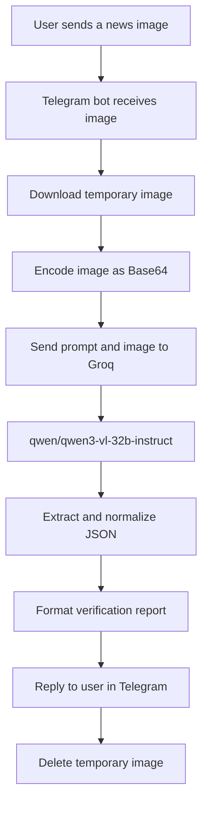

# FakeBreak AI News Verification Bot

> **Think Before You Trust. Verify Before You Share.**

## 🏆 Hackathon Project

Developed in **6.5 hours** during **C2C Edge Mysore Tech Habba - 2026**. **#TeamSSFGC** participated through a nomination from our college.

### Team

| Role | Member |
| --- | --- |
| **Team Lead** | **Nisarga NS** |
| Team Member | Sanika M |
| Team Member | Poorvika SM |
| Team Member | Likitha Singh R |


## 🧭 Quick Navigation

[Hackathon Project](#-hackathon-project) · [Overview](#-overview) · [Features](#-key-features) · [Technology Stack](#-technology-stack) · [Workflow](#-system-workflow) · [Installation](#-installation) · [Team](#-team)

## 📌 Overview

FakeBreak AI News Verification Bot is a Python-based Telegram chatbot for AI-assisted verification of news screenshots and images. Users send an image to the bot, which analyzes the visible content with a vision-language model and returns a structured report containing a claim assessment, confidence value, reasoning, contextual information, and related sources when provided by the model.

## 🚨 Problem Statement

Misleading news graphics, screenshots, and viral images can spread quickly before people have time to verify them. Manual verification requires identifying the claim, comparing information, and reviewing reliable sources. FakeBreak provides an accessible first step through Telegram by helping users inspect suspicious news images.

## 💡 Solution

Users send a news screenshot or image to the Telegram bot. The bot downloads the image, sends it with a structured verification prompt to Groq's vision-language model, normalizes the response, and sends a formatted verification report back to Telegram.

The current implementation is focused on image verification. Plain-text messages are acknowledged and users are asked to send an image.

## ✨ Key Features

- Telegram `/start` command with usage instructions.
- Image verification for Telegram photos.
- Image-file verification for image documents.
- Image description and main-claim extraction by the AI model.
- Verdict normalization to `TRUE`, `FALSE`, `MISLEADING`, or `UNCERTAIN`.
- Confidence normalization to a percentage from 0 to 100.
- Reasoning and correct-information fields in the normalized result.
- Related sources returned when available from the model.
- Long Telegram responses split into smaller messages when required.
- Temporary downloaded images removed after processing.
- AI-assisted verification disclaimer in the response.

## 🔄 System Workflow



## 🛠️ Technology Stack

### Stack at a Glance

| Layer | Technology | Purpose |
| --- | --- | --- |
| Language | **Python** | Bot logic and AI integration |
| Interface | **Telegram Bot API** | User messages and image uploads |
| AI service | **Groq** | Multimodal image analysis |
| AI model | **qwen/qwen3-vl-32b-instruct** | Image and claim interpretation |
| Configuration | **python-dotenv** | Loads local environment variables |

### Detailed Stack Labels

- **Programming Language:** Python
- **Backend:** Python Telegram bot using `python-telegram-bot`
- **AI / Machine Learning:** Groq API with `qwen/qwen3-vl-32b-instruct`
- **APIs:** Telegram Bot API and Groq API
- **Configuration:** `python-dotenv` and a local `.env` file
- **Communication:** Telegram polling

No database, Flask web application, news API, or web frontend is connected in the current implementation.

## 🏗️ Project Structure

```text
trust_chatbot/
├── app.py                 # Empty application placeholder
├── realitychecker.py      # Image analysis request, parsing, and normalization
├── requirements.txt       # Present but currently empty
├── telegram_bot.py        # Telegram handlers and polling entry point
├── verifier.py            # Empty verifier placeholder
├── templates/
│   └── index.html         # Empty HTML template placeholder
└── .env                   # Local credentials; do not commit
```

The local `venv/` and `__pycache__/` directories are runtime and environment artifacts.

## ⚙️ How It Works

1. The bot loads `TELEGRAM_BOT_TOKEN` from `.env`.
2. Telegram polling registers handlers for `/start`, photos, image documents, and text.
3. A received image is downloaded to a temporary file.
4. `realitychecker.py` encodes the file as Base64 and sends it to Groq with a verification prompt.
5. The model is instructed to describe the image, identify the main claim, choose a verdict, explain the reasoning, provide correct information, and return related sources as JSON.
6. The response is parsed and normalized defensively.
7. The bot formats and sends the report to the user.
8. The temporary image is deleted after processing.

## 📊 Verification Results

The verification engine supports these normalized verdicts:

| Verdict | Meaning |
| --- | --- |
| `TRUE` | The model classified the claim as true. |
| `FALSE` | The model classified the claim as false. |
| `MISLEADING` | The model classified the claim as misleading or lacking context. |
| `UNCERTAIN` | There was not enough usable evidence or the response could not be processed. |

The normalized result can contain an image description, claim, verdict, confidence, reasoning, correct information, and sources. The Telegram formatter currently uses some legacy field names, so image description, claim, and reasoning may display as `Not available` even when the model returns those values.

## 🚀 Installation

The current `requirements.txt` file is empty, so install the imported packages explicitly.

```powershell
py -m venv venv
.\venv\Scripts\Activate.ps1
python -m pip install python-dotenv python-telegram-bot groq
```

Create a `.env` file in the project root:

```dotenv
TELEGRAM_BOT_TOKEN=your_telegram_bot_token
GROQ_API_KEY=your_groq_api_key
```

Never commit `.env` or expose the credential values.

## ▶️ Running the Telegram Bot

With the virtual environment activated and `.env` configured, run:

```powershell
python telegram_bot.py
```

Then open the bot in Telegram, send `/start`, and upload a news screenshot or image file.

## 💬 Example User Interaction

```text
User: sends a news screenshot

Bot: Image received. Verification started.

Bot: FAKEBREAK VERIFICATION REPORT
     Verdict: TRUE / FALSE / MISLEADING / UNCERTAIN
     Confidence: percentage
     Reasoning: model-generated explanation
     Correct information: returned context
     Related sources: returned links, when available
```

Plain-text input currently receives an instruction to send an image and is not sent to the verification model.

## 🎯 Intended Users

The bot is intended for people who receive suspicious news screenshots, viral claims, or image-based information and want an AI-assisted first review before consulting authoritative sources.

## 🏛️ Project Architecture

```text
Telegram user
     │
     ▼
telegram_bot.py
     │
     ├── Downloads Telegram image
     ├── Formats Telegram response
     └── Removes temporary file
     │
     ▼
realitychecker.py
     │
     ├── Encodes image as Base64
     ├── Sends prompt and image to Groq
     ├── Parses JSON response
     └── Normalizes verdict and confidence
     │
     ▼
Groq qwen/qwen3-vl-32b-instruct
```

## ⚠️ Limitations and Disclaimer

- Only image-based verification is connected to the active Telegram workflow.
- Text claims and URLs are not independently verified by the current bot.
- Sources returned by the AI are not independently validated by the application.
- No database or verification-history storage is implemented.
- AI output can be incomplete or incorrect, especially when an image lacks context or readable text.
- A confidence score is not proof of accuracy.
- Results depend on Telegram and Groq API availability.
- The local virtual environment may need to be recreated if its Python installation is unavailable.
- `requirements.txt`, `app.py`, `verifier.py`, and `templates/index.html` are incomplete placeholders.

This is an AI-assisted tool and should not replace professional fact-checking. Review authoritative sources before making important decisions or sharing information.

## 🔮 Future Enhancements

- Add pinned dependency versions to `requirements.txt`.
- Correct the Telegram formatter to use the normalized result field names.
- Add direct text-claim and URL verification.
- Validate returned sources before displaying them.
- Add tests for JSON extraction, normalization, and report formatting.
- Add structured logging and clearer API error handling.
- Add verification history storage if required.
- Complete or remove the unused web application placeholders.
- Consider multilingual, video, reverse-image, or deepfake verification in future versions.

## 📚 Learning Outcomes

This project demonstrates asynchronous Telegram handlers, environment-variable configuration, image downloading, Base64 encoding, multimodal API integration, structured JSON parsing, defensive normalization, temporary-file cleanup, and message-length handling.

## 👥 Team

**#TeamSSFGC**

- **Nisarga NS** — Team Lead
- Sanika M
- Poorvika SM
- Likitha Singh R

## 🏆 Hackathon

Developed in **6.5 hours** at **C2C Edge Mysore Tech Habba - 2026**. The team was sent through nomination by our college.

## 📄 License

No license file is included in the repository.
